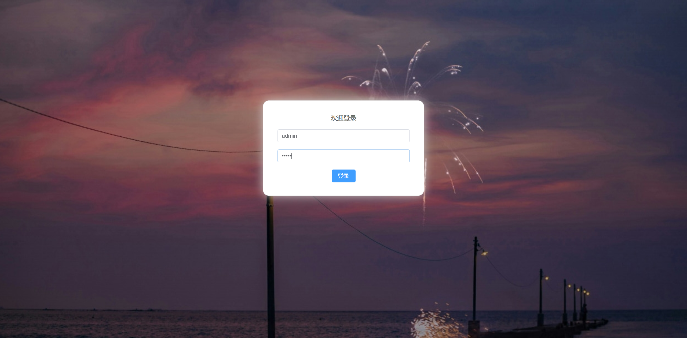
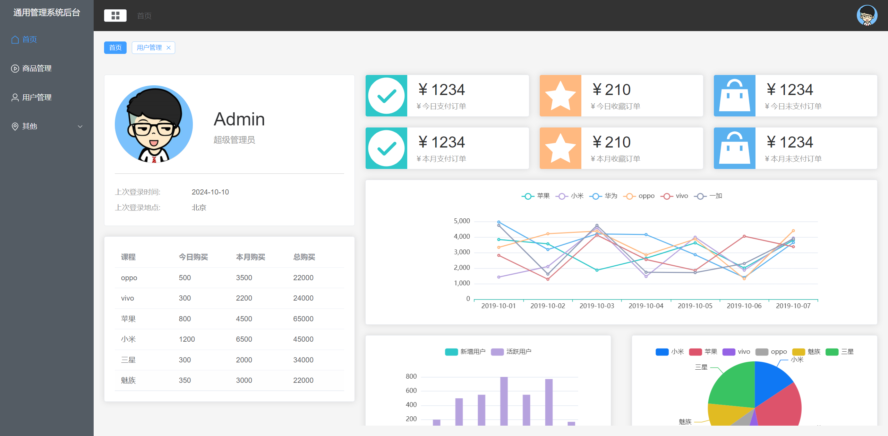
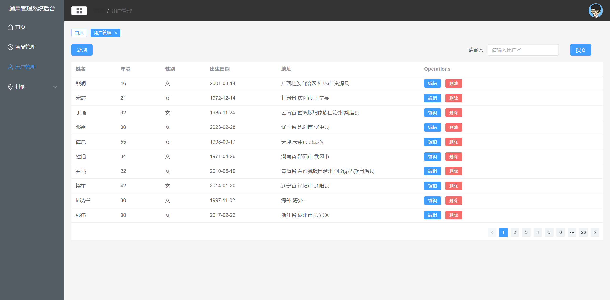

# Vue 3 + Vite + element-plus



这个是我在学习Vue3前端的一个mini project 代码, 感谢原作者的视频分享：[视频教程](https://www.bilibili.com/video/BV1LS421d7cY?spm_id_from=333.788.videopod.episodes&vd_source=d1d852b1d7bf90b2f7b5d985fa3a216c)
# 依赖与版本
```angular2html
node -v
<!--node 20.18.0-->
```
可以通过nvm管理node版本：
```angular2html
nvm install 20
nvm list
nvm use 20.18.0
```
# 直接安装
```angular2html
npm install
```
# 运行
```angular2html
npm run dev
```
# 其他
在学习过程中的一些安装，直接拉取该仓库使用`npm install`之后不需要再安装

安装插件
```angular2html
npm create vite@last my-vue-app -- -- template vue
npm install @element-plus/icon -s
npm install @element-plus/icons-vue
npm install less vue-router element-plus -s
npm install pinia
npm install axios
npm install mockjs
npm install echarts
```
